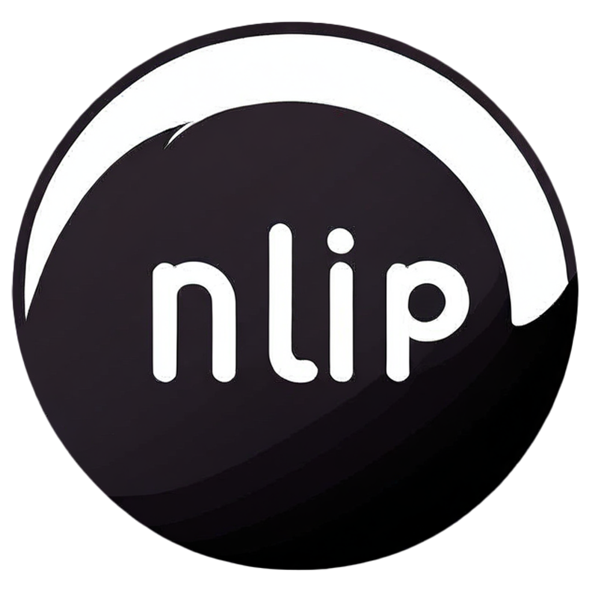

# Nlip - Network Lightweight Clipboard

English | [简体中文](./README_zh.md)

A lightweight network clipboard system **implemented by Cursor** that supports text and file sharing across multiple platforms.

<p align="center">
  
  <br>
  <a href="https://github.com/QirangMilco/nlip/releases">
    
  </a>
  <a href="https://github.com/QirangMilco/nlip/blob/main/LICENSE">
    
  </a>
  <a href="https://github.com/QirangMilco/nlip/actions">
    
  </a>
</p>

## Table of Contents

- [Features](#features)
- [Tech Stack](#tech-stack)
- [Getting Started](#getting-started)
- [Project Structure](#project-structure)
- [Development](#development)
- [Deployment](#deployment)
- [Contributing](#contributing)
- [Security](#security)
- [License](#license)
- [Acknowledgments](#acknowledgments)

## Features

### Core Features
- **Multi-platform Support**: Web, Browser Extension, Mobile App
- **Content Sharing**: Seamless text and file sharing
- **Space Management**: 
  - Space-based content organization
  - Advanced permission management
  - Collaborator invitation system with email support
  - Fine-grained collaborator access control
- **Real-time Sync**: Real-time updates across all platforms
- **Guest Features**
  - Guest uploads in public spaces
  - Guest content preview support
- **Smart Management**: 
  - Automatic expired content cleanup
  - Overflow management
  - Collaborator activity tracking

### Security Features
- **Authentication**: JWT-based user authentication
- **Access Control**: 
  - Space-level permission management
  - Role-based collaborator permissions (view/edit)
  - Secure invitation system
- **Protection**
  - Rate limiting
  - File type filtering
  - Content expiration mechanism
  - Email verification for invitations

### User Experience
- Responsive design
- Offline support
- Multi-language interface
- Dark mode

## Tech Stack

### Backend
- Go 1.20+
- Gin Web Framework
- SQLite Database
- JWT Authentication
- WebSocket Real-time Communication
- Rate Limiting
- File Storage System

### Frontend
- Web: React 18 + TypeScript 5 + Ant Design 5
- Browser Extension: Chrome Extension API + React
- Mobile App: Flutter 3
- State Management: Redux Toolkit + Redux Persist
- HTTP Client: Axios
- Build Tool: Vite

## API Documentation

For detailed API documentation, see [API Documentation](docs/api/api.md)

### API Features
- RESTful API design
- JWT authentication
- Real-time WebSocket notifications
- Rate limiting
- Standardized error handling
- API version control
- Debug mode support

### API Example

```typescript
// Login example
const response = await fetch('/api/v1/nlip/auth/login', {
  method: 'POST',
  headers: {
    'Content-Type': 'application/json'
  },
  body: JSON.stringify({
    username: 'test',
    password: '123456'
  })
});

const data = await response.json();
// Use the returned token
const token = data.token;
```

For more examples, please refer to [API Documentation](docs/api/api.md)

## Getting Started

### Prerequisites
- Go 1.20+
- Node.js 18+
- Flutter 3.0+
- SQLite 3

### Installation

1. Clone the repository
```bash
git clone https://github.com/yourusername/nlip.git
cd nlip
```

2. Install backend dependencies
```bash
cd src/backend
go mod download
```

3. Install frontend dependencies
```bash
cd src/frontend/web
npm install
```

4. Configure environment variables
```bash
# Backend
cp src/backend/config.example.json src/backend/config.dev.json
# Edit config.dev.json with your settings

# Frontend
cp src/frontend/web/.env.example src/frontend/web/.env.local
# Edit .env.local with your settings
```

5. Start development servers
```bash
# Backend
cd src/backend
go run main.go

# Frontend
cd src/frontend/web
npm run dev
```

### Development Access
- Web App: http://localhost:5173
- API Server: http://localhost:3000
- API Documentation: http://localhost:3000/swagger/index.html

## Project Structure

```
nlip/
├── src/
│   ├── backend/           # Go backend
│   │   ├── config/       # Configuration
│   │   ├── handlers/     # Request handlers
│   │   ├── middleware/   # Middleware
│   │   ├── models/       # Data models
│   │   ├── routes/       # Route definitions
│   │   ├── utils/        # Utilities
│   │   └── main.go       # Entry point
│   └── frontend/         # Frontend application
│       └── src/          # Source code
│           ├── api/      # API clients
│           ├── components/# React components
│           ├── config/   # Configuration files
│           ├── constants/# Constants
│           ├── hooks/    # Custom hooks
│           ├── pages/    # Page components
│           ├── routes/   # Route configurations
│           ├── store/    # State management
│           ├── styles/   # Style files
│           └── types/    # TypeScript definitions
├── docs/                 # Documentation
└── scripts/             # Build scripts
```

## Development

### Code Style
- Go: Follow official Go style guide
- TypeScript: ESLint + Prettier
- SCSS: Stylelint
- Commit Messages: Conventional Commits

### Branch Strategy
- main: Production ready code
- develop: Development branch
- feature/*: New features
- bugfix/*: Bug fixes
- release/*: Release preparation

## Deployment

### Docker Deployment
```bash
# Build images
docker-compose build

# Start services
docker-compose up -d
```

### Manual Deployment
See [Deployment Guide](docs/deployment.md)

## Contributing

1. Fork the repository
2. Create your feature branch (`git checkout -b feature/AmazingFeature`)
3. Commit your changes (`git commit -m 'feat: add some feature'`)
4. Push to the branch (`git push origin feature/AmazingFeature`)
5. Open a Pull Request

For detailed guidelines, see [Contributing Guide](CONTRIBUTING.md)

## Security

- JWT-based authentication
- Rate limiting
- Input validation and sanitization
- File type filtering
- Content expiration mechanism
- HTTPS enforced in production

For security issues, please refer to our [Security Policy](SECURITY.md)

## License

This project is licensed under the MIT License - see the [LICENSE](LICENSE) file for details

## Acknowledgments

- [Gin Web Framework](https://github.com/gin-gonic/gin)
- [React](https://reactjs.org/)
- [Ant Design](https://ant.design/)
- [Redux Toolkit](https://redux-toolkit.js.org/)

## Support

If you find this project helpful, please consider giving it a star ⭐️